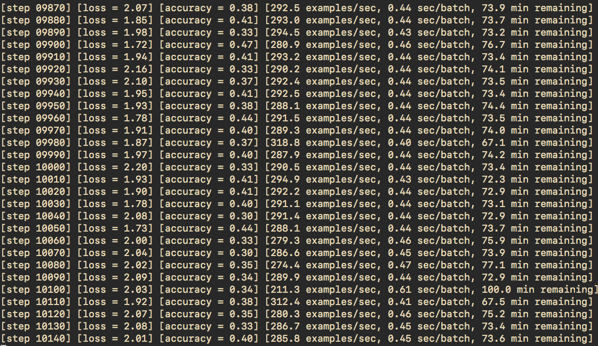

# Test 2 und Auswertung: 03.01.2017

## Erste Gedanken

Slic(o) auf dem Cifar-10 Datensatz liefert bescheidene Ergebnisse.
Wir betrachten beim Traininieren (nach dem Processing) ein Bild von `24x24`
Pixeln (nach Cropping von `32x32`).
Eine Anwendung von Slic(o) mit einer beliebigen Anzahl an gewünschten Segmenten
liefert auf einem so kleinen Bild stets Quadrate.
Das ist ernüchternd.
Damit reduzieren wir unser `24x24` nach Anwendung von Slic(o) auf 100 Segmente
auf ein `10x10` Bild und haben keinerlei Features, die wir verwenden können
außer die Meanfarbe (und andere Farbfeatures wie Absolute Difference).
Jedes weitere Feature, dass wir hinzufügen, ist bereits in den beiden Features
Farbe und Quadratgröße enthalten.
Damit blähen wir unsere Channels ohne Mehrgewinn auf.

Mit dieser Reduzierung des Bildes werden wir niemals bessere Ergebnisse
erzielen können, als auf dem eigentlichen `24x24` CIFAR-10 Bild.
Das heißt, dass wir entweder einen besseren Superpixelalgorithmus brauchen, der
dann entsprechend auch zeitintensiver ist als Slic(o) oder diese Tatsache ganz
einfach tolerieren und uns nur mit größeren Bildern beschäftigen.
Die Auswertung unterschiedlicher Superpixelalgorithmen ist natürlich auch
Bestandteil der Arbeit.

### Beispiel

Im Folgenden sind zwei Bilder dargestellt.
Das Erste zeigt ein willkürliches Bild aus dem CIFAR-10 Datensatz.
Das Zweite zeigt dieses Bild nach Anwendung von Slico mit 25 Superpixeln.
Die Superpixel sind durch die Durchschnittsfarbe des Segments gekennzeichnet.


## Weiterführende Gedanken

Cifar-10 rechnet auf Batches von `[24, 24, 3] = 1728`.
Wir rechnen auf Batches der Größe `[Knotengröße, Nachbarschaftsgröße,
Channels]`.
Damit erhalten wir eine größere oder in etwa gleich große Menge an Daten pro
Bild. (z.B. `[25, 10, 8] = 2000`).
Der Vorteil, der sich einstellt ist, dass dieser Batch bereits eine
vordefinierte Convolution darstellt.
Das heißt, wir rechnen nicht wie klassisch üblich auf 2 Convolutional-Layern,
sondern nur noch auf einem.

Die Knoten des Graphen verweisen jeweils auf ein Segment mit darin enthaltenen
Features:
* **Farbattribute:**
  * Mean
  * Absolute Difference
  * ...
* **Formattribute:**
  * Schwerpunkt
  * Anzahl Pixel
  * Ausdehnung (z.B. Höhe/Breite)
  * ...

Dann können wir unseren Graphen aufbauen, in dem wir Kantenattribute
definieren.
Jedes Kantenattribut spiegelt eine Adjazenzmatrix wieder:
* **Distanz:** mit/ohne Threshold
* **Farbunterschied:** mit/ohne Threshold
* **lokale Nachbarschaft:** mit/ohne Distanz (mit/ohne Threshhold)
* ...

Knotenattribute und Kantenattribute können auch miteinander kombiniert werden,
so dass wir mehrere Graphen erhalten mit unterschiedlichen Attributen, wobei
jeder gleiche Knotenindex jeweils das gleiche Segment beschreibt.
Das scheint mir ausbaufähig zu sein.

## Distorted Inputs

Die Idee der "Distorted Inputs" finde ich genial und wollte ich daher in meine
Implementierung miteinbauen.
Das heißt, die CIFAR10 Bilder werden zufällig verändert und auf diesen Bildern
wird dann ein Graph generiert.

Dabei ergaben sich aber ein paar Probleme:

```python
distorted_image = tf.image.random_brightness(distorted_image, max_delta=0.5)
float_image = tf.image.per_image_standardization(distorted_image)
```

Jede der obrigen Zeilen Code sorgt dafür, dass wir nicht mehr auf normalen
RGB-Bildern arbeiten, sondern auf `float`-Bildern inklusive negativen Zahlen.
Superpixelalgorithmen kommen damit nicht gut zurecht (oder zumindest kommt es
mir so vor).

In der TensorFlow Api steht bei `random_brightness` sowie `random_contrast`
dazu:

> This is a convenience method that converts an RGB image to float
> representation, adjusts its contrast, and then converts it back to the
> original data type.

Es wundert mich ein wenig, dass `random_contrast` die Konvertierung zurück in 
RGB gelingt, `random_brightness` aber nicht.
Ich habe obige Zeilen daher für die Distorted Inputs erstmal rausgenommen.

Wie wichtig sind diese Anpassungen?
Wie könnte ich sie verwenden und weiterhin darauf Superpixel berechnen?

Distorted Inputs auf den Receptive Fields des generierten Graphen scheinen mir
unmöglich, da diese die Graphstruktur verändern würden (z.B. bei
Farbunterschied als Kantenattribut).

## Speichern des Graphdatensatzes

Über die vergangenen Wochen war das leider mein Hauptproblem.
Ich weiß nicht ob ich mich unnötig verrannt habe, aber ich hatte die Idee,
den Graphen und die daraus berechneten Receptive Fields zur Laufzeit beim
Lernen zu erstellen.
Genau nachdem die eigentlichen Bilder zufällig verändert wurden.
Die Ernüchterung schlug ziemlich schnell ein, denn dann muss dieser Prozess als
Graph-Model in TensorFlow implementiert werden.
Dann bin ich auf `py_func` gestoßen und habe festgestellt, dass die
Konvertierung des Bildes zur Laufzeit darüber keinen Sinn macht, da es einfach
zu langsam ist.
Ich war teilweise bei 2 Examples/sec.

Den Gedanken, diesen ganzen Prozess als einen TensorFlow-Graphen darzustellen,
ist immernoch aktuell.
Jedoch ist das nicht so einfach wie es klingt.
Die Graphgenerierung habe ich als TensorFlow Operation bereits implementiert.
Es ist jedoch nicht so schnell, dass es einen umhauen würde.
Das ist denke ich auch der Tatsache geschuldet, dass ich Aufrufe wie `map_fn`
pro Segment mache.
Die Adjazenzgenerierung dauert ebenso ewig.
Bei der Konvertierung dieses Graphen in Receptive Fields sieht es ebenfalls
nicht so glänzend aus.
Ich brauche Sachen wie `betweenness_centrality`, die nicht so einfach als
TensorFlow Operation auf Adjazenzmatrizen auszudrücken sind.
Ich bin ein bisschen verzweifelt.

Aktuell generiere ich mir daher eine `tfrecords` Datei für Training und
Evaluation.
Das tue ich auf den distorted inputs des CIFAR-10 Datensatzes und speichere mir
folglich für den Trainingsdatensatz auch mehrere Epochen.
Aber auch hier Ernüchterung:
Eine Konvertierung einer Epoche (also 50.000 Bilder) dauert in etwa eine
Stunde.

## Graphgenerierung

Ein paar Randdaten zur Graph- und Receptive-Fields-Generierung:

* **Slico:**
  * Segmente: `50`
  * Compactness: `1.0`
  * Sigma: `0.0`
  * Max iterations: `10`
* **Graphgenerierung:**
  * Knotenfeatures: `[red, green, blue, center_y, center_x, count, height,
    width]`
    * Center ist prozentual zur Bounding Box des Segments
    * Height and Width beschreiben die Ausdehnung der Bounding Box
  * Kantenattribute:
    * bisher nur lokale Nachbarschaft mit Gewicht `1`
* **Patchy-San:**
  * Knotenlabeling: Scan-Line-Order
  * Knotengröße: `25`
  * Stride: `2`
  * Nachbarschaftsgröße: `10`
  * Nachbarschaftslabeling: Betweeness Centrality

Das liefert mir ein Example der Form `[25, 10, 8]`.

## Convolutional Neural Net

Ich habe mir einen kleinen Convolutional Neural Net Wrapper geschrieben, bei
dem ich die Netzstruktur über eine JSON-Datei angeben kann.
Diese sollte relativ selbsterklärend sein.
Für diesen Test sieht diese wie folgt aus:

```json
{
  "batch_size": 128,
  "last_step": 20000,
  "structure": {
    "conv": [
      {
        "output_channels": 64,
        "weights": { "stddev": 5e-2, "decay": 0.0 },
        "biases": { "constant": 0.1 },
        "fields": { "size": [1, 5], "strides": [1, 1] },
        "max_pool": { "size": [1, 3], "strides": [1, 2] }
      }
    ],
    "local": [
      {
        "output_channels": 384,
        "weights": { "stddev": 0.04, "decay": 0.004 },
        "biases": {"constant": 0.1 }
      },
      {
        "output_channels": 192,
        "weights": { "stddev": 0.04, "decay": 0.004 },
        "biases": { "constant": 0.1 }
      }
    ],
    "softmax_linear": {
      "output_channels": 10,
      "weights": { "stddev": 0.005, "decay": 0.0 },
      "biases": { "constant": 0.0 }
    }
  }
}
```

## Auswertung

Gerechnet wurde über 20000 Steps mit einer Batch-Size von 128.
Die Dauer dafür wurde auf 150 Minuten geschätzt.
Das ist im Vergleich zum reinen Lernen auf dem CIFAR-10 Datensatz ein
ordentlicher Gewinn.
Da habe ich auf der CPU fast doppelt so lange gebraucht.

| Step  | Loss | Accuracy |
| -----:| ----:| --------:|
| 0     | 21   | 0.1      |
| 1400  | 10   | 0.3-0.4  |
| 2500  | 5.5  | 0.3-0.4  |
| 4000  | 3    | 0.3-0.4  |
| 6000  | 2    | 0.3-0.4  |
| 10000 | 2    | 0.3-0.4  |

Die Accuracy pendelt sich relativ früh auf 0.3-0.4 ein. Das ist ziemlich
schlecht, aber zumindest nicht zufällig 😂.
Die Loss pendelt sich nach 6000 Steps auf ungefähr 2 ein.



## Evaluation

Viele Features sind unnötig, weil sie immer das gleiche beinhalten.
Das ist durch die gleiche Form der Superpixel leicht zu erklären.
Darunter fallen `center_y, center_x, count, width, height`.
Das heißt, dass 5 von 8 Features unnötig sind (zumindest für das kleine
CIFAR-10 Netz).
Deswegen bin ich mit dem aktuellen Resultat erst einmal zufrieden.

## Weiteres Vorgehen

* Receptive-Fields Generierung als TensorFlow Operation dynamisch zur Laufzeit
  anstatt statisch
* Unterschiedliche Superpixelalgorithmen anwenden (die eventuell auch auf
  kleinen Bildern gut funktionieren)
* Weitere Gedanken zu geeigneten Graphrepräsentation
* Andere Datensätze mit größeren Bildern
