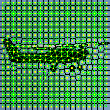
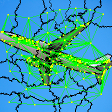
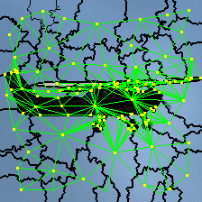

# Test 3 und Auswertung: 13.01.2017

## Ueberlegungen

### PascalVOC

PascalVOC Datensatz ist nicht so einfach fuer die reine Bildklassifizierung zu
gebrauchen. Wenn ich jedes Bild auf `224x224` croppe (anhand der Bounding Box
und mittels eventuellem Resizing), dann erhalte ich teilweise grauenhafte
Bilder wie abgeschnittene Boote oder ein Stuhl der als Stuhl klassifiziert ist
auf dem ein Hund liegt.

**Ideen:**
* entweder Objekterkennung mittels Graphen
* besserer/anderer Datensatz
* Bilder auf Bounding Box croppen (reine Imagesize ist ja fuer die Umwandlung
  in einen Graphen egal)

* Falls Bounding Box klein, aber immer noch gross genug, sollte ueberlegt
  werden, das Bild hochzuscalen.

### Superpixelalgorithmus

Es ist teilweise schwer, Formfeatures fuer Polygone zu extrahieren, die ueber
das Polygon viel aussagen. Deswegen ist es umso besser, wenn
Superpixelalgorithmen nicht zu grosse Superpixel berechnen und diese, wenn sie
nichts interessantes enthalten, moeglichst quadratisch sind. Dann kann ueber
die Form auf die Wichtigkeit dieses Superpixels geschlossen werden.

* Compactness von SLIC benoetigt einen relativ hohen Wert, damit
  Superpixelregionen recht quadratisch werden (bei PascalVOC ist 30 ein guter
  Wert)

#### SLIC

#### Quickshift

#### Felzenszwalb

#### SEEDs

### Graphlabeling

Der erste Schritt der Receptive Fields ist es, eine Ordnung der Knoten zu
bestimmen.

Auffaellige Superpixel mit besonderen Formen, die nicht quadratisch
sind, geben der Bildklassifizierung wahrscheinlich mehr Informationen, als
Superpixel die nicht quadratisch sind und nur auffuellen. Daher sollten die
Knoten eventuell nach Auffaelligkeit im ersten Schritt sortiert werden, d.h.
anhand ihrer Form oder anhand ihrer unterschiedlich farbigen Nachbarn.

**Idee:**
* Nachbarschaftslabeling fuer ausgewaehlte Knoten basierend auf Distanz zum
  Knoten
* Knotenauswahl basierend auf Auffaelligkeit, Besonderheit der Knoten
